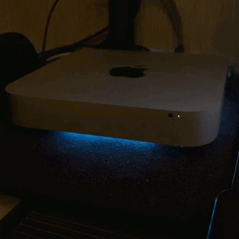
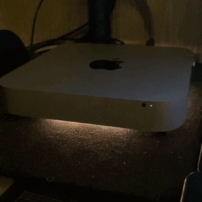
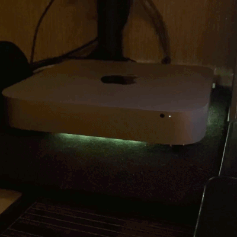
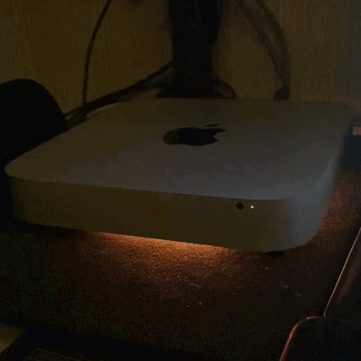

# AppleMAC-LED for RP2040 Zero

AppleMAC-LED is a macOS status-light project for the Waveshare RP2040 Zero and
a WS2812B-compatible LED strip. A background agent detects local system
activity and sends lighting commands over USB Serial at 115200 baud.

The controller uses only USB. The music overlay changes the brightness of the
current animation while keeping its colors and normal idle breathing.

## Project contents

```text
AppleMACled_RP2040_Zero/   Current RP2040 Zero Arduino firmware
MacAgent/                  macOS agent and installation tools
*.gif                      Lighting-effect previews
```

The agent uses protocol v2 and requires the RP2040 firmware.

Lighting events include:

- normal slow color pulsing;
- Finder copy and AirDrop activity;
- Safari downloads;
- App Store downloads and updates;
- Arduino IDE compilation and firmware uploads for different board families;
- ChatGPT activity in Safari and the macOS app;
- Codex task activity;
- Trash emptying;
- Wi-Fi and Bluetooth connection notifications;
- system-audio-reactive brightness;
- a smooth fade to black when the agent stops.

## Lighting previews

<table>
  <tr>
    <td align="center" width="50%">
      <strong>Wi-Fi and Bluetooth</strong><br>
      <br>
      <sub>Connected Wi-Fi network or Bluetooth device</sub>
    </td>
    <td align="center" width="50%">
      <strong>Music visualization</strong><br>
      <br>
      <sub>System-audio-reactive lighting</sub>
    </td>
  </tr>
  <tr>
    <td align="center" width="50%">
      <strong>Transfers and file copies</strong><br>
      <br>
      <sub>Safari downloads, AirDrop, or file-copy activity</sub>
    </td>
    <td align="center" width="50%">
      <strong>ChatGPT</strong><br>
      <br>
      <sub>ChatGPT on the web or in the macOS app</sub>
    </td>
  </tr>
</table>

## Hardware and wiring

Required:

- Waveshare RP2040 Zero;
- WS2812B-compatible 5 V LED strip, 20 LEDs by default;
- regulated 5 V strip power supply and a USB data cable;
- 330 to 470 ohm resistor on the strip data line;
- AO3400A N-channel MOSFET, 330 ohm gate resistor, and 10 kOhm gate pull-down
  for hardware USB recovery.

| Function | GPIO | RP2040 Zero physical pin |
|---|---:|---:|
| External strip DIN | GP2 | 21 |
| Self-reset MOSFET gate | GP3 | 20 |

The onboard RGB LED on GP16 is left untouched.

```text
RP2040 GP2 ----- 330 to 470 ohm ----> WS2812B DIN
External 5 V -----------------------> WS2812B +5V
RP2040 GND -------------------------> Strip and power-supply GND
Mac USB ----------------------------> RP2040 Zero USB-C

RP2040 GP3 ----- 330 ohm -----------> AO3400A Gate
MOSFET Gate ---- 10 kOhm -----------> GND
MOSFET Source ----------------------> GND
MOSFET Drain -----------------------> RP2040 RUN
```

GP3 HIGH pulls RUN low through the MOSFET. The external gate pull-down releases
RUN during reset. Keep GP3 dedicated to this circuit.

All devices must share GND. Never apply 5 V to a GPIO or power the strip through
a GPIO. Avoid back-feeding the board from multiple power sources. A 470 to
1000 uF capacitor near the strip and a suitable 3.3 V to 5 V level shifter
such as a 74AHCT125 are recommended.

## Arduino IDE

Install the `Raspberry Pi Pico/RP2040` board package by Earle F. Philhower and
the `FastLED` library from Arduino Library Manager.

```text
Board: Waveshare RP2040 Zero
Flash Size: 2MB (no FS)
CPU Speed: 125 MHz
USB Stack: Pico SDK (default)
Serial Monitor: 115200 baud
```

Open `AppleMACled_RP2040_Zero/AppleMACled_RP2040_Zero.ino` and upload it.
`EEPROM` and `hardware/watchdog.h` are included in the Arduino-Pico core;
FastLED is the only additional Arduino library.

Release the installed agent's port before flashing or using Serial Monitor:

```bash
CMD="$HOME/Library/Application Support/AppleMAC-LED/applemacled.command"
"$CMD" usb-pause
```

Afterward:

```bash
"$CMD" usb-resume
```

## Configurable controller identity

The default controller ID is `APPLEMAC_LED_RP2040_DEFAULT`. Change it in:

```text
AppleMACled_RP2040_Zero/controller_identity.h
```

Use 8 to 96 letters, digits, dots, underscores, colons, or hyphens. Recompile
the controller and rerun `MacAgent/install.command` after a change. The
installer copies this value to `controller-id.txt` in the agent's Application
Support directory. `APPLEMACLED_CONTROLLER_ID` can override it when invoking
the agent manually.

```text
CMD:IDENTIFY:<controller-id>
RSP:IDENTIFY:<controller-id>:APPLEMAC_LED_RP2040:2
```

The agent scans native USB CDC ports and accepts only an exact identity
response. This ID prevents accidental selection of unrelated serial devices;
it is a device selector, not encryption or cryptographic authentication.

## Installing the macOS agent

Requirements: macOS 13 or newer, Python 3.9 or newer, Apple Command Line Tools,
and internet access for the first dependency installation.

```bash
xcode-select --install
cd /path/to/AppleMACled/MacAgent
chmod +x *.command
./install.command
```

The installer builds and signs the native monitor locally, installs
`applemacled_agent.py`, creates an isolated `.applemacled-venv` environment, and
registers a LaunchAgent that starts after login. Python dependencies are
`pyserial` and PyObjC Cocoa.

Installed paths:

```text
~/Applications/AppleMACLED Agent.app
~/Library/Application Support/AppleMAC-LED/
~/Library/Logs/AppleMAC-LED/
~/Library/LaunchAgents/com.applemacled.agent.plist
```

The installer resets permissions for the signed application and verifies
them in sequence:

1. Accessibility for limited Finder, Safari, App Store, and ChatGPT UI state.
2. Downloads folder access for Safari download detection.
3. Screen and System Audio Recording for audio levels. No screen image is stored.
4. Bluetooth for newly connected device notifications.

Keep Terminal open until installation succeeds. If macOS asks to restart during
the audio-permission stage, choose Later and press Return in Terminal after
enabling the permission. The installer restarts its helper and verifies access.

Installing the agent replaces an existing AppleMAC-LED installation.

## Diagnostics and commands

```bash
CMD="$HOME/Library/Application Support/AppleMAC-LED/applemacled.command"
"$CMD" ports
"$CMD" status
"$CMD" usb-reconnect
./diagnose.command
tail -f "$HOME/Library/Logs/AppleMAC-LED/agent.log"
```

Manual lighting commands:

```bash
"$CMD" reboot
"$CMD" shutdown-leds
"$CMD" snake-on
"$CMD" snake-off
"$CMD" copy-on
"$CMD" copy-off
"$CMD" chatgpt-on
"$CMD" chatgpt-off
"$CMD" appstore-on
"$CMD" appstore-off
"$CMD" trash-flash
"$CMD" system-blue
```

The background agent normally manages the effects. `shutdown-leds` fades the
strip to black; an explicit `usb-resume` establishes a new identity session
and returns the controller to normal operation.

## Troubleshooting

- Missing port: check that the cable supports data, try another USB port, and
  verify the board and USB stack in Arduino IDE.
- Identity rejected: check protocol-v2 firmware and matching controller IDs;
  reinstall the agent after changing `controller_identity.h`.
- Strip dark: check 5 V, shared GND, DIN direction, GP2, and `LED_COUNT`.
- Incorrect colors or flicker: check power stability, short data wiring, a
  suitable level shifter, and the strip input capacitor.
- Port occupied: use `usb-pause` before flashing and `usb-resume` afterward.
- Missing activity detection: run `diagnose.command` and check macOS permissions.

## Uninstalling

Run `MacAgent/uninstall.command`. Runtime files and logs are preserved.
To remove those as well:

```bash
rm -rf "$HOME/Library/Application Support/AppleMAC-LED"
rm -rf "$HOME/Library/Logs/AppleMAC-LED"
```

## Privacy and customization

The controller has no network stack. The agent reads local system state for
lighting and stores no screen images. Runtime messages are in English;
localized UI labels remain internal detection patterns.

Hardware and animation constants such as `LED_PIN`, `LED_COUNT`,
`MAX_BRIGHTNESS`, and `PULSE_PERIOD_MS` are near the top of the RP2040 sketch.

## License

AppleMAC-LED is released under the [MIT License](LICENSE).
